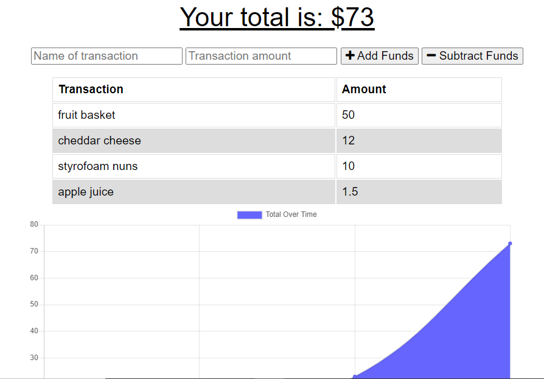

# Budget Tracker

## Purpose
To add and subtract funds based on specific expenses to plan and keep track of a budget.

Users can enter the names and amounts of their transactions in the forms and use the bottons to add or subtract from the total. Entered transactions are listed below and also charted with a graph.
Service workers are utilized to ensure that should the user be in an area without an internet connection, not only will the website function, but any entered transactions will be safely stored and applied once their connection is restored.

## Built with
*HTML
*CSS
*Javascript

## Utilizing
*Bootstrap
*Mongo
*Express
*Mongoose

## Website
https://tracker-for-budget.herokuapp.com/

## Contribution
Made by James

